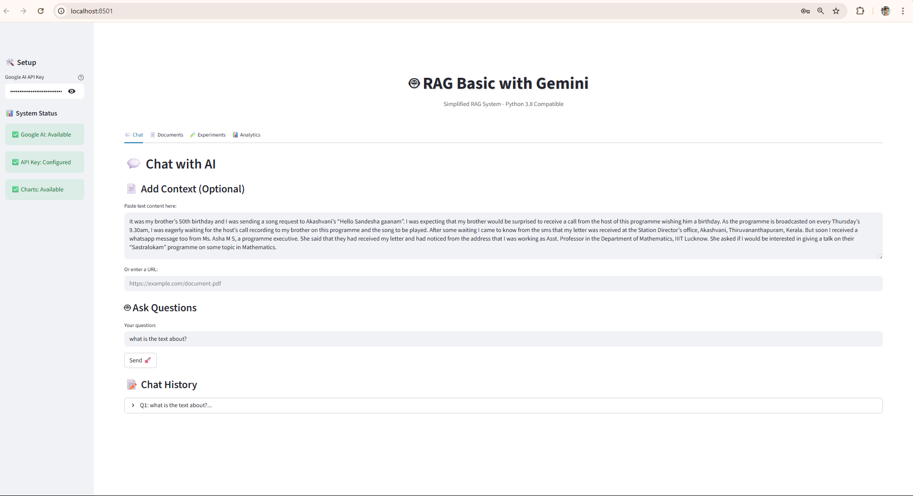
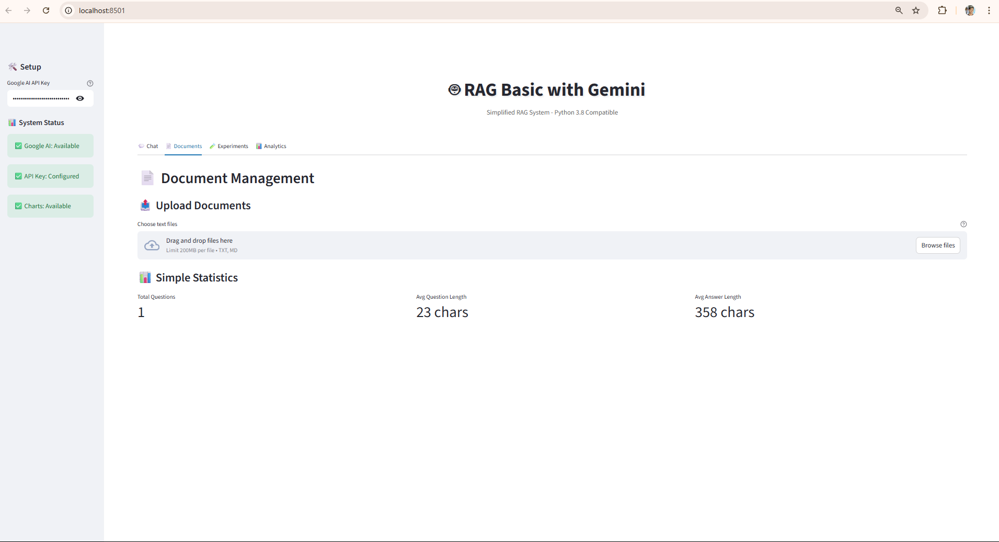
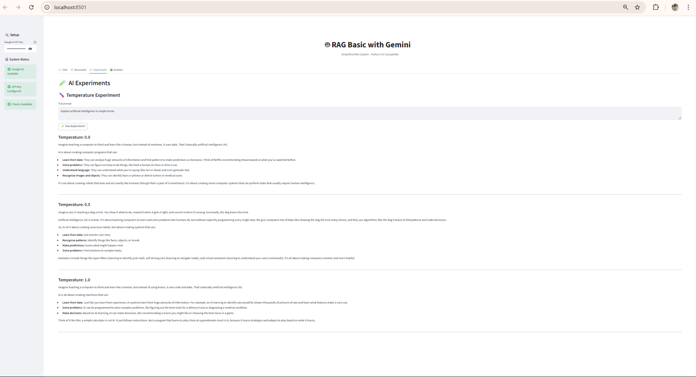

# RAG using LangChain with Google Gemini

A comprehensive project demonstrating how to build a Retrieval-Augmented Generation (RAG) application using LangChain and Google Gemini AI model.

## Project Overview

This project builds a text-to-text RAG application that:
- Uses Google Gemini Pro model for text generation
- Implements LangChain for LLM application development
- Demonstrates parameter tuning (temperature, top_k, top_p, etc.)
- Builds a complete RAG system with PDF document processing
- Provides interactive examples through Jupyter notebooks

## Features

- **🤖 LLM Integration**: Direct integration with Google Gemini models
- **🎛️ Parameter Experimentation**: Test different model configurations  
- **📄 Document Processing**: Load and process PDF documents
- **🔍 Vector Embeddings**: Create and store document embeddings
- **🔗 RAG Chain**: Complete retrieval-augmented generation pipeline
- **📓 Interactive Notebooks**: Step-by-step implementation guide
- **🌐 Beautiful Web Interface**: Streamlit-based GUI for easy interaction
- **💬 Chat Interface**: Real-time conversation with your documents
- **📊 Analytics Dashboard**: Performance metrics and usage analytics
- **🧪 Experiment Hub**: Interactive parameter tuning interface

## Screenshots

Get a visual preview of the RAG application in action:

| Application Interface | RAG System Demo | Analytics Dashboard |
|:---------------------:|:---------------:|:-------------------:|
|  |  |  |

### 📱 **Image 1: Application Interface**
Shows the main Streamlit web interface with navigation sidebar, API key setup, and clean, modern design that makes the RAG system accessible to users of all technical levels.

### 🤖 **Image 2: RAG System in Action** 
Demonstrates the document Q&A functionality where users can upload PDFs, ask questions, and receive contextually accurate answers powered by Google Gemini and vector search.

### 📊 **Image 3: Analytics Dashboard**
Displays the performance metrics, usage statistics, and interactive charts that help users understand how their RAG system is performing and optimize parameters accordingly.

## Project Structure

```
RAG using LangChain with Google Gemini/
├── app.ipynb                   # Main notebook with all tasks
├── streamlit_app.py           # Beautiful Streamlit web application
├── streamlit_basic.py         # Python 3.8 compatible basic app
├── run_app.py                 # Application launcher script
├── run_basic.py               # Basic app launcher
├── src/                        # Source code modules
│   ├── __init__.py
│   ├── config.py              # Configuration settings
│   ├── gemini_client.py       # Google Gemini client wrapper
│   ├── document_processor.py  # PDF processing utilities
│   ├── embeddings_handler.py  # Embedding generation and storage
│   └── rag_chain.py          # RAG chain implementation
├── data/                      # Data directory
│   └── documents/            # PDF documents for RAG
├── images/                    # Screenshots and demo images
│   ├── 1.png                 # Application interface screenshot
│   ├── 2.png                 # RAG system in action
│   └── 3.png                 # Analytics dashboard view
├── outputs/                   # Generated outputs and results
├── config/                    # Configuration files
│   └── .env.example          # Environment variables example
├── .streamlit/               # Streamlit configuration
│   └── config.toml          # App theme and settings
├── requirements.txt           # Python dependencies
├── setup.py                  # Package setup
├── SOLUTION_SUMMARY.md       # Import error solutions guide
└── README.md                 # This file
```

## Installation

1. Clone or download this project
2. Install dependencies:
   ```bash
   pip install -r requirements.txt
   ```
3. Set up your Google AI API key:
   - Copy `config/.env.example` to `config/.env`
   - Add your Google AI API key to the `.env` file

### Option 1: Web Application (Recommended)
4. Launch the beautiful Streamlit app:
   ```bash
   python run_app.py
   ```
   Or directly:
   ```bash
   streamlit run streamlit_app.py
   ```

### Option 2: Jupyter Notebook
4. Open and run the Jupyter notebook:
   ```bash
   jupyter notebook app.ipynb
   ```

## Tasks Overview

### 1. Introduction
- **Task 0**: Get Started
- **Task 1**: Import Libraries

### 2. Interact with Google Gemini
- **Task 2**: Ask Questions Using Prompts
- **Task 3**: Chat with Gemini and Retrieve Chat History

### 3. Experiment with Parameters
- **Task 4**: Temperature Parameter
- **Task 5**: Max Output Tokens Parameter
- **Task 6**: Top-k Parameter
- **Task 7**: Top-p Parameter
- **Task 8**: Candidate Count Parameter

### 4. Build RAG System
- **Task 9**: Introduction to Retrieval-Augmented Generation
- **Task 10**: Load PDF and Extract Text
- **Task 11**: Create Gemini Model and Generate Embeddings
- **Task 12**: Create RAG Chain and Query

## API Key Setup

You'll need a Google AI API key to run this project:

1. Visit [Google AI Studio](https://makersuite.google.com/app/apikey)
2. Create a new API key
3. Add it to your environment variables or directly in the code (for development only)

## Usage

### Web Application Interface

Launch the Streamlit app for the best experience:
```bash
python run_app.py
```

The web interface provides:
- 🏠 **Home Dashboard**: System overview and quick actions
- ⚙️ **Setup Page**: Configure API keys and model parameters
- 📚 **Document Manager**: Upload and manage PDF files
- 💬 **Chat Interface**: Interactive Q&A with your documents
- 🧪 **Experiments Hub**: Test different model parameters
- 📊 **Analytics Dashboard**: Performance metrics and insights

### Jupyter Notebook

For learning and experimentation, use the comprehensive notebook:
```bash
jupyter notebook app.ipynb
```

### Programmatic Usage

### Basic Text Generation
```python
import google.generativeai as genai

genai.configure(api_key='your-api-key')
model = genai.GenerativeModel('gemini-1.5-flash-latest')

response = model.generate_content("Explain machine learning in simple terms")
print(response.text)
```

### RAG System Usage
```python
from src.rag_chain import RAGChain

# Initialize RAG system
rag = RAGChain(api_key='your-api-key')

# Load documents
rag.load_documents('data/documents/')

# Ask questions
answer = rag.query("What is artificial intelligence?")
print(answer)
```

## Key Dependencies

- **🐍 LangChain**: Framework for LLM applications
- **🤖 Google GenerativeAI**: Google's Gemini model access
- **🗂️ ChromaDB**: Vector database for embeddings
- **📄 PyPDF**: PDF document processing
- **📓 IPython**: Interactive notebook support
- **🌐 Streamlit**: Beautiful web application framework
- **📊 Plotly**: Interactive data visualization
- **💬 Streamlit-Chat**: Enhanced chat interface components

## Learning Outcomes

After completing this project, you'll understand:
- How to integrate Google Gemini with LangChain
- Parameter tuning for optimal LLM performance
- Building RAG systems for document Q&A
- Vector embeddings and similarity search
- Best practices for LLM application development

## Troubleshooting

### Common Issues

1. **API Key Error**: Ensure your Google AI API key is correctly set
2. **Import Errors**: Make sure all dependencies are installed
3. **PDF Loading Issues**: Check file paths and PDF accessibility
4. **Memory Issues**: Consider reducing chunk sizes for large documents

## Contributing

Feel free to contribute by:
- Adding new features
- Improving documentation
- Reporting bugs
- Suggesting enhancements

## License

This project is for educational purposes. Please check Google AI's terms of service for API usage guidelines.

## Additional Resources

- [LangChain Documentation](https://python.langchain.com/)
- [Google AI Documentation](https://ai.google.dev/)
- [Gemini API Reference](https://ai.google.dev/api)
- [RAG Best Practices](https://python.langchain.com/docs/use_cases/question_answering/)
